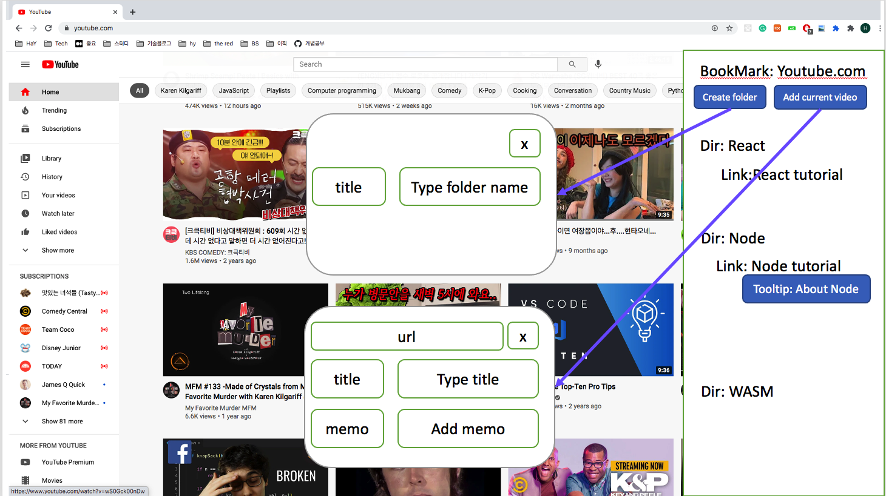

# Toy Project One: TS-CHROME-EXTENSION
- [Getting started](https://developer.chrome.com/docs/extensions/mv2/getstarted/)
- [developer chrome](https://developer.chrome.com/)
- [API reference](https://developer.chrome.com/docs/extensions/reference/#popups)
  
## Getting Started 읽어보자
- Chrome Extension은 무엇으로 구성 되는가?
    1. background-scripts
    2. content scripts
    3. options page
    4. UI elements
    5. ... various logic files
    6. 웹개발 기술: HTML, CSS, JavaScript

- Extentions란?
  - 소프트웨어 프로그램으로, 웹기술을 기반으로 User의 크롬 사용 경험을 커스터마이징 할 수 있게 해준다


## Extention 개발 하기
1. [manifest](https://developer.chrome.com/docs/extensions/mv2/manifest/) 파일 만들기 
    - manifest? 이게 무슨 프로그램인지 소개해주는 느낌의 json 파일
    - manifest 파일을 가지고 있는 directory는 developer mode에 extension으로 추가 가능하다


2. [background script](https://developer.chrome.com/docs/extensions/mv2/background_pages/)
    - backgroud page가 호출되는 경우
        ```
        - The extension is first installed or updated to a new version.
        - The background page was listening for an event, and the event is dispatched.
        - A content script or other extension sends a message.
        - Another view in the extension, such as a popup, calls runtime.getBackgroundPage.
        ```

3. [user interface](https://developer.chrome.com/docs/extensions/mv2/user_interface/)
    - [page action](https://developer.chrome.com/docs/extensions/reference/pageAction/)
    - [popup 이란?](https://developer.chrome.com/docs/extensions/mv2/user_interface/#popup)
      - extension 버튼을 누렀을때 나오는 창, 마치 웹페이지 같은 것
      - html, css는 포함하지만 inline js는 안된다
    - [icon 설정](https://developer.chrome.com/docs/extensions/mv2/user_interface/#icons)
      - default_icons: 툴바에 나오는 아이콘
      - icons: 그외의 용도

3. [declarativeContent](https://developer.chrome.com/docs/extensions/reference/declarativeContent/)
    - [ShowPageAction](https://developer.chrome.com/docs/extensions/reference/declarativeContent/#type-ShowPageAction)
      - 조건이 맞으면 page action을 보여주는 곳

4. [popup.js]
    - [storage](https://developer.chrome.com/docs/extensions/reference/storage/)

5. [content script](https://developer.chrome.com/docs/extensions/mv2/content_scripts/#pi)
    - [active tab](https://developer.chrome.com/docs/extensions/mv2/manifest/activeTab/)
      - 이걸 통해서 [tabs.executeScript](https://developer.chrome.com/docs/extensions/reference/tabs/#method-executeScript) 가 실행가능하다


## Bookmarks for Each Site
개발하다보니까, 참고하는 자료가 너무 많아서 상단 북마크만으로 관리가 좀 어려웠다. 

bookmark를 관리해주는 다른 extension이 많은데, 나는 특히 도메인 별로 북마크를 관리하고 싶었다. 

youtube 페이지에가면 youtube 북마크해놓은 내용만 구조를 짜서 볼 수 있게 하고 싶고, stackoverflow에서는 stackoverflow 북마크만 구조별로 볼 수 있었으면 하는.. 

그리고 솔직히 북마크 해놓고 이거뭐였는지 기억이 안나서, 북마크 위에 마우스를 대면 툴팁처럼 이게 무슨 영상이었는지 설명하는 메모창이 있었으면 좋겠다. 

### 기능 개발 과정
#### 1. 일단은 youtube page에서만 되도록 구현을 해보자!


1. youtube page 북마크 
  - "youtube page에서 extension 활성화 하는 방법"
    ```javascript
    // background.js

    conditions: [
      new chrome.declarativeContent.PageStateMatcher({
        pageUrl: { hostContains: "youtube.com" },
      }),
    ],
    ```
  - chrome [tabs](https://developer.chrome.com/docs/extensions/reference/tabs/): 
    - executeScripts에 대한 설명은 [여기](https://developer.mozilla.org/en-US/docs/Mozilla/Add-ons/WebExtensions/API/tabs/executeScript)에 더 잘나와있다. Page에 JavaScript 코드를 넣어준다

    ```javascript
    // popup.js
    changeColor.onclick = function (element) {
      let color = element.target.value;
      // query: chrome.tab.query(queryInfo: object, callback: function)
      chrome.tabs.query({ active: true, currentWindow: true }, function (tabs) {
        chrome.tabs.executeScript(tabs[0].id, { file: "/slider.js" });
      });
    };
    ```

// TODO:  아직 contents script가 뭔지 잘모르겠어서 파악하기
// TODO: exectue Script 는 onclick에 달아서 써도 되는건지? 조사하기

   - data 저장 어떻게 할지? [sync storage vs local storage](https://developer.chrome.com/docs/extensions/reference/storage/)

- browse객체: https://love2dev.com/blog/ways-to-use-javascript-redirect-to-another-page/


1. 각 마크한 내용에 memo 추가하기


